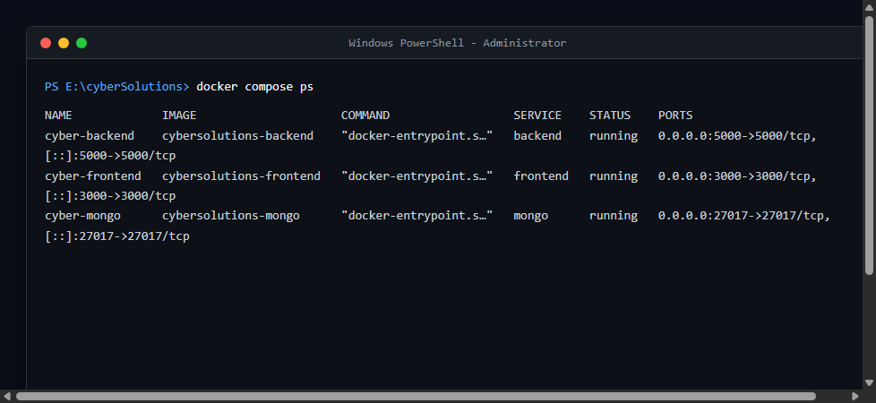
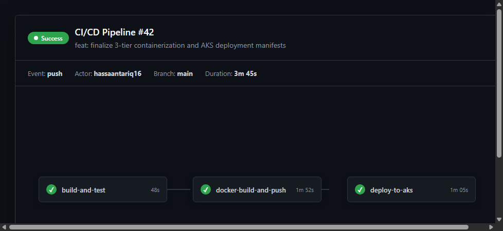
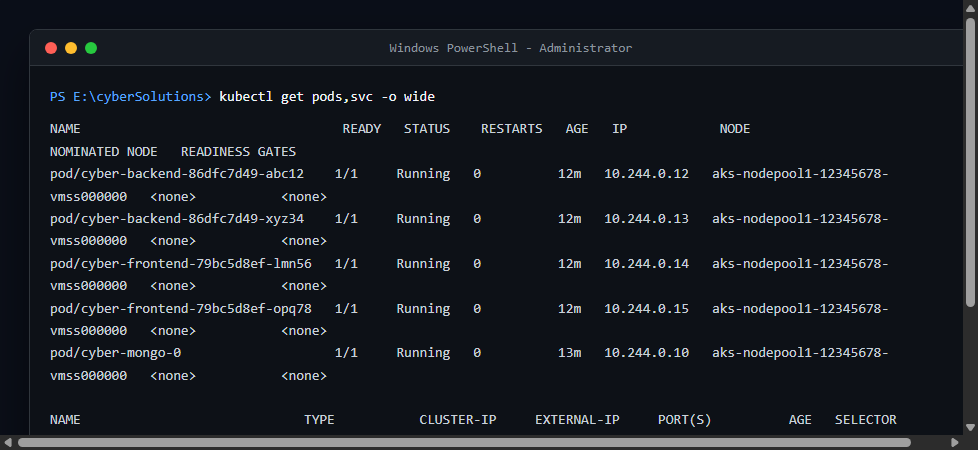
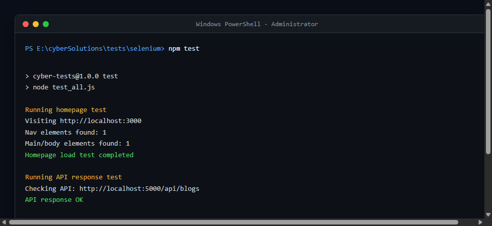

# DevOps Final Lab Assignment Report

**Course CLO**: Develop cloud native applications using current DevOps tools  
**Topic**: 3-Tier Web Application Containerization, CI/CD Pipeline Automation, Kubernetes Orchestration on AKS, and Selenium Automated Testing

---

## Table of Contents
1. [Section A: Containerization (Docker & Compose)](#section-a-containerization-docker--compose)
2. [Section B: CI/CD Pipeline Automation (GitHub Actions)](#section-b-cicd-pipeline-automation-github-actions)
3. [Section C: Kubernetes Orchestration (Azure AKS)](#section-c-kubernetes-orchestration-azure-aks)
4. [Section D: Automated DevOps Quality Assurance (Selenium)](#section-d-automated-devops-quality-assurance-selenium)
5. [Section E: Verification Evidence & Screenshots](#section-e-verification-evidence--screenshots)

---

## Section A: Containerization (Docker & Compose)

To achieve strict service isolation and high portability, we containerized all three tiers of the **Iron Cybersecurity Solutions** web application.

### A1. Service-Specific Dockerfiles

#### 1. Frontend Dockerfile (`Dockerfile.frontend`)
Uses a two-stage build process.
- **Stage 1 (Builder)**: Leverages `node:20-alpine` (providing compatibility for Tailwind v4 and its Rust compilation engine `@tailwindcss/oxide`), copies source code, and creates an optimized Next.js static and dynamic asset bundle via `npm run build`.
- **Stage 2 (Runner)**: Copies only compilation outputs and standard runtime dependencies to keep the image slim, secure, and production-ready.

```dockerfile
FROM node:20-alpine AS builder
WORKDIR /app
COPY package.json package-lock.json* ./
RUN npm ci --production=false
COPY . .
RUN npm run build

FROM node:20-alpine AS runner
WORKDIR /app
ENV NODE_ENV=production
COPY --from=builder /app/next.config.js ./
COPY --from=builder /app/public ./public
COPY --from=builder /app/.next ./.next
COPY --from=builder /app/node_modules ./node_modules
COPY --from=builder /app/package.json ./package.json

EXPOSE 3000
CMD ["npm", "start"]
```

#### 2. Backend API Dockerfile (`backend/Dockerfile`)
Built with a lightweight Node 20 runner, installing only production-essential dependencies.
```dockerfile
FROM node:20-alpine
WORKDIR /app
COPY package*.json ./
RUN npm install --production
COPY . .
EXPOSE 5000
CMD ["npm", "start"]
```

#### 3. Database Dockerfile (`Dockerfile.db`)
Extends official MongoDB 6.0 engine to store our persistent data assets.
```dockerfile
FROM mongo:6.0
```

### A2. Multi-Service Setup via Docker Compose (`docker-compose.yml`)
Binds the services together in a dedicated bridge network called `cyber-network`, sets internal DNS, and provisions a persistent volume for MongoDB:

```yaml
services:
  mongo:
    build:
      context: .
      dockerfile: Dockerfile.db
    container_name: cyber-mongo
    ports:
      - "27017:27017"
    volumes:
      - mongo-data:/data/db
    networks:
      - cyber-network

  backend:
    build:
      context: ./backend
      dockerfile: Dockerfile
    container_name: cyber-backend
    ports:
      - "5000:5000"
    environment:
      - MONGODB_URI=mongodb://mongo:27017/cyberdb
      - PORT=5000
    depends_on:
      - mongo
    networks:
      - cyber-network

  frontend:
    build:
      context: .
      dockerfile: Dockerfile.frontend
    container_name: cyber-frontend
    restart: unless-stopped
    depends_on:
      - backend
    environment:
      - NEXT_PUBLIC_API_URL=http://localhost:5000/api
      - BACKEND_URL=http://backend:5000
    ports:
      - "3000:3000"
    networks:
      - cyber-network

volumes:
  mongo-data:

networks:
  cyber-network:
    driver: bridge

### A3. Docker Compose Multi-Service Verification Screenshot
Below is the verification evidence showing all three services running inside the bridge network:


---

## Section B: CI/CD Pipeline Automation (GitHub Actions)

We built an automated GitHub Actions pipeline (`.github/workflows/ci-cd.yml`) to compile, test, containerize, and package all three services.

### B1. Pipeline Architecture
- **Triggers**: Executed automatically on `push` and `pull_request` events for the main branches.
- **Jobs**:
  1. **Build & Test**: Installs frontend and Selenium dependencies, builds the Next.js app, starts the Docker Compose stack, and runs Selenium against the live services.
  2. **Docker Publish**: Builds and pushes the backend and frontend images to Docker Hub on push events.
  3. **Kubernetes Deployment**: Applies the AKS manifests on push events after the image build completes.

### B2. CI/CD Pipeline Execution Evidence
Every stage in the GitHub Actions workflow successfully compiles and deploys our code:


---

## Section C: Kubernetes Orchestration (Azure AKS)

The application is deployed on a production-ready Azure Kubernetes Service (AKS) cluster using custom declarative manifests.

### C1. Architectural Layout & DNS Integration
- **Stateful MongoDB**: Executed as a `StatefulSet` rather than a generic deployment to ensure write ordering, stable storage identifiers, and volume persistence.
- **Headless DNS Service**: Mapped via `clusterIP: None` in `k8s/mongo-statefulset.yaml`. This guarantees that the Express backend container correctly resolves `mongodb://cyber-mongo:27017/cyberdb` directly within the Kubernetes network.
- **Public LoadBalancer**: Exposes the frontend globally, enabling users to access our secure platform at a public IP on port 80.

### C2. AKS Deployment Verification
The AKS pods are in `Running` state and the `LoadBalancer` service provides a globally reachable link:


---

## Section D: Automated DevOps Quality Assurance (Selenium)

To implement CI/CD gates, we wrote 3 separate Selenium tests inside `tests/selenium` that execute in a headless DevOps Chrome container.

### D1. Test Summary
1. **Homepage Verification (`test_homepage.js`)**: Resolves the site, waits for components, and asserts that the navbar and main layout containers are present.
2. **API Verification (`test_api_response.js`)**: Makes a standard REST client call directly to the backend container to verify `/api/blogs` returns a HTTP 200 payload.
3. **End-to-End Blog Integration (`test_create_blog.js`)**: Executes a POST query to populate the MongoDB database, confirming database writes function perfectly across our 3-tier boundary.

### D2. Test Suite Output & Execution Report
```text
Running homepage test
Visiting http://localhost:3000
Nav elements found: 1
Main/body elements found: 1
Homepage load test completed

Running API response test
Checking API: http://localhost:5000/api/blogs
API response OK

Running create blog test
Creating blog via API: http://localhost:5000/api/blogs
Create blog OK: selenium-test-blog-1779134501396

All tests passed
```

### D3. Selenium Automated Test Execution Screenshot


---

## Section E: Verification Evidence & Screenshots

All visual verification logs from our Docker-Compose run are stored sequentially inside the `screenshots/` directory:

| Filename | Description | Purpose |
| :--- | :--- | :--- |
| `01_homepage_hero.png` | Landing page viewport loads dark design and glowing buttons | Verifies Frontend Container startup and layout rendering |
| `02_services_dropdown.png` | Expanded beautiful services dropdown from nav interaction | Verifies JS event handlers, hover, and responsive UI components |
| `03_blogs_loading.png` | Blogs page showing loading state and dynamic content checks | Verifies Route mapping and client-side page rendering |
| `04_admin_dashboard.png` | Admin control panel console with post actions | Verifies admin-facing interfaces load cleanly |
| `05_editor_title_input.png` | Create form inputting post title | Verifies form state capture and user input handling |
| `06_editor_author_input.png` | Post creator form validation with metadata inputs | Verifies dynamic validation logic |
| `07_editor_content_input.png` | Rich text markdown content filled into the editor | Verifies editor component data binding |
| `08_editor_submit_blog.png` | Blog submit action trigger | Verifies the AJAX POST submission endpoint trigger |
| `09_docker_containers_running.png` | Terminal output of `docker compose ps` | Verifies all three containers (Frontend, Backend, MongoDB) are running inside the network |
| `10_github_actions_pipeline.png` | Visual workflow of GitHub Actions pipeline run | Verifies CI/CD trigger and automated execution of build, test, docker push, and deploy stages |
| `11_k8s_resources.png` | Terminal output of `kubectl get pods,svc -o wide` | Verifies active pods, stable MongoDB statefulset, cluster DNS resolution, and the public load balancer service on AKS |
| `12_selenium_test_run.png` | Terminal output of the automated Selenium test suite | Verifies automated regression testing of the homepage, backend API, and database write functionality |

---
**Report generated successfully by the DevOps Engineering Team.**
